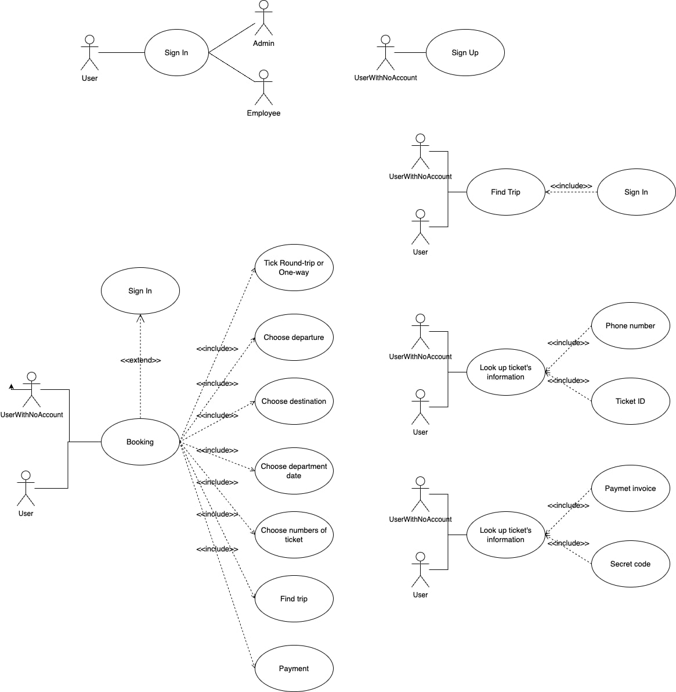

# Business Objectives


## Guide customers to have a fast and effective ticket purchasing experience:
- 1: Access the website
- 2: Select itinerary information
- 3: Select seat, pick up and drop off location, enter customer information
- 4: Choose payment method
- 5: Successfully purchased tickets


# Trip Information:
## Ticket type:
- One-way ticket
- A round-trip ticket

## Ticket purchasing process:
- Step 1: Destination and departure point
     - Search near the customer's location if there is a bus station nearby
- Step 2: Travel date, number of people (number of tickets)
     - If it is a round-trip ticket, you can choose the return date

- Step 3:
     - Choose a time to go
     - Seat type (seating, bed, limosine, double bed)
     - Select pick-up location (company branches, allowing customers to enter their location, offering options close to the customer's location).
     - Select transfer (empty seat, earliest departure time)
     - Select seat number

- Step 4: Choose payment method (top up the application to pay, ZaloPay, Momo, VNPay, AirPay, ApplePay, SamsungPay,...)

- Step 5: Confirm successful payment -> successful ticket purchase -> electronic invoice and bus ticket will be sent to email address


# Database:

**Users**
|  first_name  |  last_name  |  city     |        email        |   Phone      |        password         |  isActive  |
| ------------ | ------------| --------- |---------------------|--------------|-------------------------|------------|
|   Nguyen     |  Huynh Man  | TP.HCM    | nhman2002@gmail.com |  0123456789  | string(hashed password) |  active    |
|     John     |     Doe     | Hai Phong | something@gmail.com |  0234342512  | string(hashed password) |  disable   |
|..............|.............|...........|.....................|..............|.........................|............|


**Tickets**
|    ID  |  User_Phone  |     Type    | `ticket_context`|    paid  |    price   |   paid_medthod |
| ------ | ------------ | ------------| --------------- | -------- |----------- |--------------- |
|   10   | 0123456789   |     1_way   |     Object      |  cancel  |  200.000đ  |   card         |
|   20   | 0234342512   | round-trip  |     Object      | fulfilled|  100.000đ  |   cod          |
|   30   | 0362678789   | round-trip  |     Object      |  pending |  100.000đ. |   momo         |
|........|..............|.............|.................|..........|............|................|

**Ticket_context**
- `If ticket is 1-way -> returnDate can be null`

|      departure    |   destination  |           departmentDate               |  returnDate | trip | seatNum |
| ----------------- | -------------- | ---------------------------------------| ----------- |------|---------|
|        11111      |      19292     |     2024-02-25T00:00:00-02:00Z (dayjs) |     null    |  101 |    B01  |
|        22222      |      30040     |     2024-01-25T00:00:00-02:00Z (dayjs) |  02/02/2024 |  202 |    B02  |
|...................|................|........................................|.............|......|.........|


**Trip**
|    ID   |     license    |  seatNum  | driver |  vallet | seatType |  price  |     seat     |
| ------- | -------------- | ----------|--------|---------|----------|---------|--------------|
|   101   |  51-F1-12345   |     45    | 99999  | [55555] | bed      |250,000d |[A01,A02,...] |
|   202   |  51-F2-54321   |     16    | 44444  | [22222] | limousine|200,000d |[B01,B02,...] |
|.........|................|...........|........|.........|..........|.........|..............|

**Branch**
|    ID   |        address       |   city    |  district  |  ward  |
| ------- | -------------------- | ----------|------------|--------|
|   11111 |  227 Dien Bien Phu   |   TP.HCM  | Binh Thanh |   16   |
|   22222 | 123 Nguyen Van Troi  |   TP.HCM  |      1     |    5   |
|.........|......................|...........|............|........|


**Employeee**
|    ID   | first_name  |  last_name   |  address  |   tax  |   type   |
| ------- | ----------- | -------------|-----------|--------|----------|
| 11111   |    Nguyen   |     Van A    |227 NVC,...| 111111 | vallet   |
| 44444   |    Nguyen   |     Van B    |123 MDC,...| 222222 | driver   |
| 55555   |     Vu      |     Tran     |911 HTQ,...| 333333 | staff    |
|.........|.............|..............|...........|........|..........|


# Database Constraint

- `Users`
    - Phone is unique, not null
    - First_name, Last_name, City, Email, phone, password, isActive is not null
    - phone is an array, we dont know whether the user have multiple phone number

- `Tickets`
    - ID is unique, not null
    - User_Phone, type, ticket_context, paid, price is not null
    - ticket_context:
        - departure, destination, departmentDate, trip is not null


- `Trip`
    - ID is unique, not null
    - license, seatNum, driver, staff is not null
    - staff is an array, we dont know whether the bus trip have multiple staff
    - seat is an array.

- `Branch`
    - ID is unique, not null
    - address, city, district, ward is not null

- `Employeee`
    - ID is unique, not null
    - first_name, last_name, address is not null


# Functionality:

- `Users`:
    - Create new `User`
    - Update `Users`:
        - Update email(string), password(string), isActive (active, disable)

- `Tickets`:
    - Create new `Ticket`
    - Update `Ticket` paid(fulfilled, pending, cancel), price(string)
    - Update `Ticket` type(1-way, round-trip) -> Update ticket_context on returnDate(string)
    - Update `ticket_context`:
        - Udpate `ticket_context` on departmentDate(string), returnDate(string), trip(string)

- `Ticket_booking`
    - Create new `Ticket_booking`
    - Update `Ticket_booking` seat(update new array)
    - Remove `Ticket_booking`

- `Trip`:
    - Create new `Trip`
    - Remove `Trip`
    - Update `Trip` on driver(number) and staff(array)

- `Branch`:
    - Create new `Branch`
    - Remove `Branch`

- `Employee`:
    - Create new `Employee`
    - Remove `Employee`
    - Update `Employee` on tax(string), type(string) and address(string)


# Transaction Frequency

Below are the list of functionalities (transactions) that the system will provide. The list is divided into 2 parts: Users and Ticket. Each part will have a list of transactions that the user can perform, with their appropriate estimated frequency.


## `Users`
| Order | Functionality         |    Frequency   |
| ----- | --------------------- | -------------- |
| USR1  | Login                 | ~70.000/day   |
| USR2  | Create new users      | ~100/day       |
| USR3  | Update Users infos    | ~200/day       |
| USR4  | Remove Users          | ~100/year      |
| USR5  | Retrieve Users infos  | ~70.000/day   |


## `Tickets`
| Order | Functionality         |    Frequency   |
| ----- | --------------------- | -------------- |
| TIK1  | Create new Ticket     | ~60.000/day    |
| TIK2  | Update ticket type    | ~1.000/day     |
| TIK3  | Update ticket price   | ~1.000/day     |
| TIK4  | Update ticket paid    | ~1.500/day     |
| TIK5  | Update ticket_context | ~1.000/day     |
| TIK6  | Retrieve ticket infos | ~100.000/day   |
| TIK7  | Remove ticket         | ~60.000/year   |


## `Trip`
| Order | Functionality         |    Frequency   |
| ----- | --------------------- | -------------- |
| TRP1  | Create new Trip       | ~20/year       |
| TRP2  | Update Trip's Driver  | ~20/year       |
| TRP3  | Update Trip's Staff   | ~100/month     |
| TRP4  | Retrieve Trip's infos | ~1.000/day     |
| TRP5  | Remove Trip           | ~50/year       |
| TRP6  | Update Trip's seat    | ~1000/day     |


## `Branch`
| Order | Functionality         |    Frequency   |
| ----- | --------------------- | -------------- |
| BRH1  | Create new Branch     | ~10/year       |
| BRH2  | Retrieve Branch infos | ~1.000/day     |
| BRH3  | Remove Branch         | ~10/year       |

## `Employee`
| Order | Functionality            |    Frequency   |
| ----- | ------------------------ | -------------- |
| EMP1  | Create new Employee      | ~50/month      |
| EMP2  | Update Employee address  | ~100/month     |
| EMP3  | Update Employee tax      | ~100/month     |
| EMP4  | Update Employee type     | ~10/month      |
| EMP5  | Retrieve Employee infos  | ~200/day       |
| EMP6  | Remove Employee          | ~20/year       |


# Detailed Assessment 

Since the system is a bus station management system, transactions related to `users` and `ticket` are the most frequent and important transactions. We estimated some frequency information of the database based on the information given in the requirements overview document, and have decided to use the following assumptions:

 The database will be used by a large bus station, with around **500-10.000** clients accesssing the page per day.
- The bus station access will be open throughout the day(24/7)
- On average, there will be around **200-1000** ticket requests per day.
- On average, there will be around **500-1000** trip requests to update the seat per day.
- The bus station will have around **500-1.000** staff (including drivers and vallet), **100-1.000** regular staffs.
- An trip will take around **3-16** hours.
- With the above assumptions, we estimated that there will be on average **32-90** clients per trip per day.


# Data Volume Assessment

We have estimated that the following collections:

- Users
- Tickets
- Trip

will hold the most data, which are also the most important collections of the system as they are related to the most frequent transactions of the database. In more details, we have estimated the following data volume for each of these collection:

| Table                | No of records (to date) | No of records/day | No of records/month |
| -------------------- | ----------------------- | ----------------- | ------------------- |
| Users                | ~1.000.000              | 500-1.000         | 10.000-20.000       |
| Tickets              | ~10.000.000             | 1.000-5.000       | 20.000-100.000      |
| Trip                 | ~100.000                | 100-500           | 2.000-10.000        |


# Data Usage Assessment
Below are the "considered-essential" transactions of the database, which account for **500-1.000%** of the total transactions:

- USR1: Users Login
- USR5: Retrieve Users infos
- TIK1: Create new Ticket
- TIK2: Update ticket type
- TIK3: Update ticket price
- TIK4: Update ticket paid
- TIK6: Retrieve ticket infos
- TIK7: Remove ticket

- TRP6: Update Trip's seat


### Cross-Reference matrix
| Transaction/Collections  | USR1 |     |     |      | USR5 |     |     |     | TIK1 |     |     |     |
| ------------------------ | ---- | --- | --- | ---- | ---- | --- | --- | --- | ---- | --- | --- | --- |
|                          | I    | U   | D   | F    | I    | U   | D   | F   | I    | U   | D   | F   |
| Users                    |      |     |     | x    |      |     |     | x   |      |     |     |     |
| Tickets                  |      |     |     |      |      |     |     |     | x    |     |     | x   |
| Trip                     |      |     |     |      |      |     |     |     |      |     |     |     |
| Branch                   |      |     |     |      |      |     |     |     |      |     |     |     |
| Employee                 |      |     |     |      |      |     |     |     |      |     |     |     |


| Transaction/Collections  | TIK2 |     |     |      | TIK3 |     |     |     | TIK4 |     |     |     |
| ------------------------ | ---- | --- | --- | ---- | ---- | --- | --- | --- | ---- | --- | --- | --- |
|                          | I    | U   | D   | F    | I    | U   | D   | F   | I    | U   | D   | F   |
| Users                    |      |     |     |      |      |     |     |     |      |     |     |     |
| Tickets                  |      | x   |     | x    |      | x   |     | x   |      | x   |     | x   |
| Trip                     |      |     |     |      |      |     |     |     |      |     |     |     |
| Branch                   |      |     |     |      |      |     |     |     |      |     |     |     |
| Employee                 |      |     |     |      |      |     |     |     |      |     |     |     |


| Transaction/Collections  | TIK6 |     |     |      | TIK7 |     |     |     | TRP6 |     |     |     |
| ------------------------ | ---- | --- | --- | ---- | ---- | --- | --- | --- | ---- | --- | --- | --- |
|                          | I    | U   | D   | F    | I    | U   | D   | F   | I    | U   | D   | F   |
| Users                    |      |     |     |      |      |     |     |     |      |     |     |     |
| Tickets                  |      |     |     | x    |      |     | x   |     |      |     |     |     |
| Trip                     |      |     |     | x    |      |     |     |     |      | x   |     |     |
| Branch                   |      |     |     | x    |      |     |     |     |      |     |     |     |
| Employee                 |      |     |     |      |      |     |     |     |      |     |     |     |
| Ticket_booking           |      |     |     |      |      |     |     |     |      |     |     |     |


<!-- Conclusion here -->
Looking at the table we can see that:

- **Ticket** collection spans accors 6 transactions, which is the most among all collections. This is because the **Ticket** table is one of the main collection of the system, and is related to many other collections.
- **Users** collection spans across 3 transactions, which is the second most among all collections. This is because the **Users** table is also one of the main collection of the system, and is related to many other collections.


### Estimated number of references:

**Note**:

```md
- The collections and fields accessed by the transaction and the type of access (find, insert, update, delete).
- The fields used in any search conditions (filtering criteria).
- For a query, the fields that are involved in the join of 2 or more collections(Aggregation pipeline stages).
- The expected frequency at which the transaction will run.
- The performance goals for the transaction (response time, throughput, etc.)
```


### USR1:

**Login**

- Transaction volume:
  - Average: 1,000-4,000 per hour
  - Peak: 2,000-5,000 per hour (around 19:00 to 22:00), or 3,000-10,000 per hour (on weekends)
- Code:
```
    nosql 
```

- Search condition: none
- Join columns: none
- Ordering column: none
- Grouping column: none
- Built-in functions: none
- Columns updated: none
- Expected response time: < 1s

| Trans | Relations          | Types of access | No of references |              |               |
| ----- | ------------------ | --------------- | ---------------- | ------------ | ------------- |
|       |                    |                 | Per transaction  | Avg per hour | Peak per hour |
| USR1  |                    | F               | 0                | 1,000-4,000  |  2,000-5,000  |
| Total |                    |                 | 0                | 1,000-4,000  |  2,000-5,000  |


### USR5: 

**Retrieve Users infos**

- Transaction volume:
  - Average: 10-50 per hour
  - Peak: 50-100 per hour (around 19:00 to 22:00), or 100-500 per hour (on weekends)
- Code:
```
    nosql 
```

- Search condition: none
- Check condition: `db.users.findOne({email: Email)`
- Ordering column: none
- Grouping column: none
- Built-in functions: none
- Columns updated: none
- Expected response time: < 1s

| Trans | Relations          | Types of access | No of references |              |               |
| ----- | ------------------ | --------------- | ---------------- | ------------ | ------------- |
|       |                    |                 | Per transaction  | Avg per hour | Peak per hour |
| USR5  |                    | F               | 0                | 10-50        | 50-100        |
| Total |                    |                 | 0                | 10-50        | 50-100        |


### TIK1:  

**Create new Ticket**

- Transaction volume:
  - Average: 50-100 per hour
  - Peak: 100-500 per hour (around 19:00 to 22:00), or 200-500 per hour (on weekends)
- Code:
```
    nosql 
```

- Search condition: none
- Check condition: `db.branch.find({Id:{ $in: preferredIDs }})`, `db.trip.findOne({Id: id})`
- Ordering column: none
- Grouping column: none
- Built-in functions: none
- Columns updated: 
```
db.tickets.insertOne({
   ID: 40,
   User_Id: "04",
   Type: "1_way",
   ticket_context: {
      departure: 33333,
      destination: 44444,
      departmentDate: new Date("2024-03-16T00:00:00Z"),
      returnDate: null,
      trip: 303,
      seatNum: "B05",
   },
   paid: "pending",
   price: "150.000đ",
   paid_medthod: "card,
});
```
- Expected response time: < 1s

| Trans | Relations          | Types of access | No of references |              |               |
| ----- | ------------------ | --------------- | ---------------- | ------------ | ------------- |
|       |                    |                 | Per transaction  | Avg per hour | Peak per hour |
| USR5  |                    | I               | 4                | 50-100       | 100-500       |
| Total |                    |                 | 4                | 50-100       | 100-500       |


### TIK2:

**Update ticket type**

- Transaction volume:
  - Average: 20-50 per hour
  - Peak: 100-250 per hour (around 19:00 to 22:00), or 18-22 per hour (on weekends)
- Code:
```
    nosql 
```

- Search condition: none
- Check condition: none
- Ordering column: none
- Grouping column: none
- Built-in functions: none
- Columns updated: 
```
db.tickets.updateOne(
  { ID: id },
  { 
    $set: {
      "Type": "round_trip",
      "price": "200.000d",
      "ticket_context.returnDate": "2024-03-16T00:00:00Z"
    } 
  }
);
```
- Expected response time: < 1s

| Trans | Relations          | Types of access | No of references |              |               |
| ----- | ------------------ | --------------- | ---------------- | ------------ | ------------- |
|       |                    |                 | Per transaction  | Avg per hour | Peak per hour |
| USR5  |                    | U               | 0                | 20-50        | 100-250       |
| Total |                    |                 | 0                | 20-50        | 100-250       |


## Use Case:


